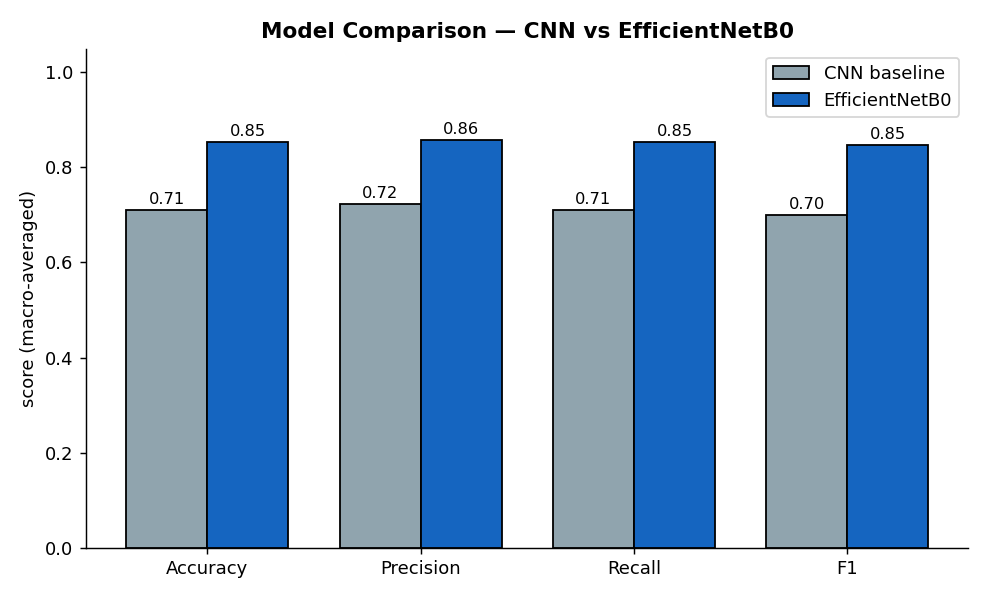
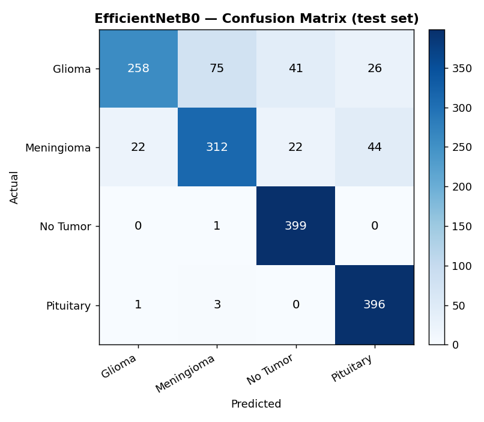
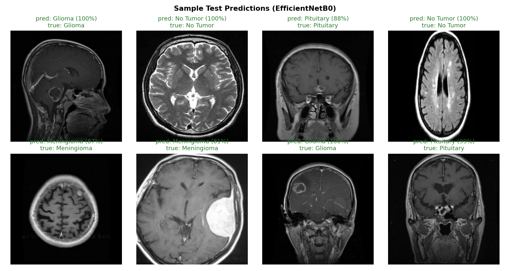
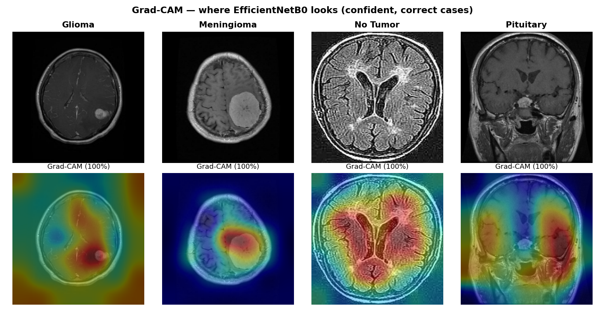
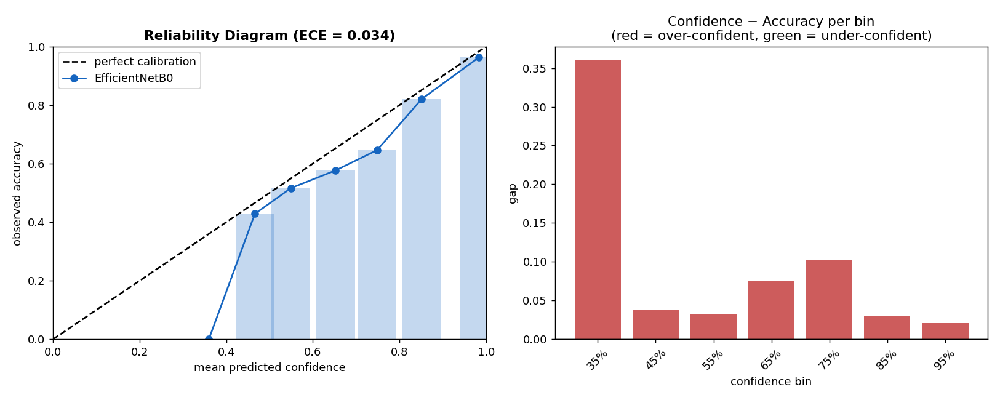
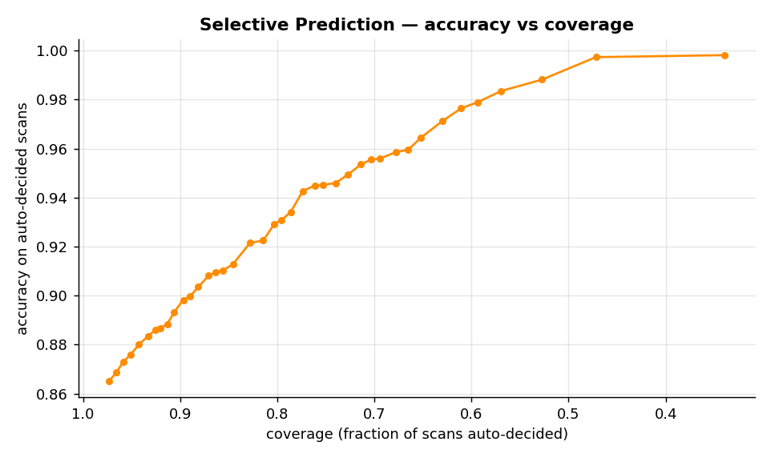
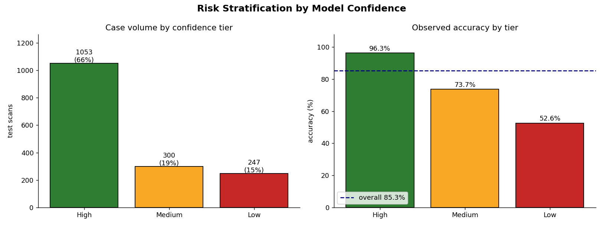

# 🧠 Brain Tumor MRI Classification — Explainable Medical AI


[](https://github.com/rajyadawad/brain-tumor-mri-dataset/actions/workflows/ci.yml)


An end-to-end deep-learning project that classifies brain MRI scans into four categories —
**glioma**, **meningioma**, **no tumor**, and **pituitary** — and goes well beyond raw accuracy to
deliver **Grad-CAM explainability**, **confidence calibration**, **selective prediction**, and a
simulated **clinical decision-support system (CDSS)**.

> ⚕️ **Medical disclaimer** — This project is for **research and educational purposes only**. It is
> **not** a medical device and must not be used for actual diagnosis or treatment decisions.

---

## Table of Contents

- [Overview](#overview)
- [Results at a glance](#results-at-a-glance)
- [Dataset](#dataset)
- [Model architectures](#model-architectures)
- [Training process](#training-process)
- [Evaluation & results](#evaluation--results)
- [Explainability (Grad-CAM)](#explainability-grad-cam)
- [Calibration & reliability](#calibration--reliability)
- [Selective prediction](#selective-prediction)
- [Clinical decision-support simulation](#clinical-decision-support-simulation)
- [Repository structure](#repository-structure)
- [Quick start](#quick-start)
- [Reproducibility](#reproducibility)
- [Limitations](#limitations)
- [Future work](#future-work)
- [License & author](#license--author)

---

## Overview

Convolutional neural networks classify brain tumours from MRI with high accuracy, but in a clinical
setting accuracy alone is not enough — a model also needs to **explain** its predictions and **know
when it is uncertain**. This project builds a from-scratch CNN baseline, upgrades to **EfficientNetB0
transfer learning**, and then layers on the trust-and-safety analysis a real diagnostic-support tool
would require:

- **Explainability** — Grad-CAM heatmaps showing *where* the model looks, with a tightness/attention
  assessment of those explanations.
- **Calibration** — Expected Calibration Error (ECE) and a reliability diagram: does a stated 90%
  confidence actually mean 90% accuracy?
- **Selective prediction** — a risk–coverage study quantifying how accuracy improves when the model
  may abstain and route low-confidence scans to a human.
- **Clinical decision support** — confidence-tiered risk stratification, auto-generated diagnostic
  reports, and a fail-safe human-in-the-loop escalation policy.

The full narrative lives in one reproducible notebook,
[`notebooks/brain_tumor_classification.ipynb`](notebooks/brain_tumor_classification.ipynb); the same
pipeline is also factored into an importable, tested [`src/`](src) package with `train`, `evaluate`,
and single-image inference (`app/predict.py`) entry points.

---

## Results at a glance

| Model              | Accuracy   | Macro Precision | Macro Recall | Macro F1   | ECE (10-bin) |
|--------------------|------------|-----------------|--------------|------------|--------------|
| CNN (baseline)     | 71.0%      | 0.724           | 0.710        | 0.700      | 0.130        |
| **EfficientNetB0** | **85.3%**  | **0.857**       | **0.853**    | **0.847**  | **0.034**    |

Transfer learning lifts test accuracy by **~14 points** over the from-scratch CNN **and** cuts
calibration error by ~4×. Metrics are computed by re-loading the released checkpoints from disk and
evaluating them on the held-out test set ([`results/metrics/saved_model_eval.json`](results/metrics/saved_model_eval.json));
regenerate them any time with `python scripts/generate_assets.py`.



---

## Dataset

This project uses the **[Brain Tumor MRI Dataset](https://www.kaggle.com/datasets/masoudnickparvar/brain-tumor-mri-dataset)**
by Masoud Nickparvar — itself a curated merge of the *figshare*, *SARTAJ*, and *Br35H* collections.
It ships with an official `Training/` / `Testing/` split and is **class-balanced by design** (a
minority of files carry an `-aug-` prefix, i.e. the curator augmented some classes to balance them).
We honour the official split — `Testing/` is never seen during training — so the held-out numbers
are leakage-free.

| Split    | Images / class | Classes                                | Total |
|----------|----------------|----------------------------------------|-------|
| Training | 1,400          | glioma · meningioma · notumor · pituitary | 5,600 |
| Testing  | 400            | glioma · meningioma · notumor · pituitary | 1,600 |

The dataset (~150 MB) is **not committed** to this repository. Download it from Kaggle and place it so
the structure is:

```
Dataset/
├── Training/   (glioma · meningioma · notumor · pituitary)
└── Testing/    (glioma · meningioma · notumor · pituitary)
```

The path is configurable via the `BRAIN_MRI_DATA_DIR` environment variable (see
[`src/config.py`](src/config.py)).

---

## Model architectures

**CNN baseline** — four `Conv → BatchNorm → ReLU → MaxPool` blocks, global average pooling, and a
dropout-regularised dense head. Augmentation and `Rescaling(1/255)` normalization are baked **into the
graph** so the saved model is self-contained. An honest, from-scratch reference point.

**EfficientNetB0 (transfer learning)** — ImageNet-pretrained EfficientNetB0 backbone with a custom
classification head (GAP → Dropout → Dense(128) → Dropout → Dense(4, softmax)). EfficientNet's
built-in normalization handles preprocessing in-graph. Trained in two stages (see below).

Both models name their final convolutional layer so Grad-CAM can target it.

---

## Training process

A leakage-free split (seeded `validation_split` carved from `Training/`; untouched, **unshuffled**
`Testing/`), with all RNGs seeded (`SEED = 42`). EfficientNet uses **two-stage** transfer learning:

1. **Stage 1 — frozen backbone:** train only the new head (`Adam(1e-3)`).
2. **Stage 2 — fine-tuning:** unfreeze the top 20 backbone layers (BatchNorm stats kept frozen) and
   fine-tune at a small learning rate (`Adam(1e-5)`).

Every model trains with `EarlyStopping(restore_best_weights=True)` + `ReduceLROnPlateau`, both
monitoring `val_loss`. **Stage 2 uses a fresh `EarlyStopping`** (not the Stage-1 callback) and the
fine-tuned model is then **saved and immediately reloaded and re-evaluated** — guaranteeing the
released checkpoint is byte-for-byte the model the metrics describe. Reproduce end-to-end with:

```bash
python -m src.train        # full training
python -m src.evaluate     # evaluate the released checkpoints, write metrics JSON
```

---

## Evaluation & results

On the held-out test set (1,600 images), EfficientNetB0 reaches **85.3% accuracy** with
**235 errors**. The confusion matrix shows the expected clinical pattern — most confusion sits between
*glioma* and *meningioma* (visually similar on some slices), while *no tumor* and *pituitary* are
cleanly separated.



Random sample predictions (green = correct, red = error):



---

## Explainability (Grad-CAM)

Grad-CAM answers *“where did the model look?”*. The implementation is **Keras-3-robust**: the textbook
`Model(inputs, [conv.output, model.output])` recipe fails on a nested pretrained backbone, so we trace
a short layer-by-layer forward pass and capture the last 4-D feature map from the live computation
(see [`src/gradcam.py`](src/gradcam.py)). For confident, correct predictions the activation lands on
the tumour region — visual evidence that supports clinical trust.



Generate an overlay for any image:

```bash
python app/predict.py path/to/scan.jpg --gradcam overlay.png
```

---

## Calibration & reliability

A trustworthy clinical model should be **more confident when it is right**. We measure this with the
**Expected Calibration Error** and a reliability diagram. EfficientNetB0 is well-calibrated
(**ECE = 0.034**) — far better than the CNN baseline (ECE = 0.130). The right-hand panel shows the
per-bin confidence−accuracy gap (red = over-confident, green = under-confident).



---

## Selective prediction

If the model may **abstain** below a confidence threshold (routing those scans to a radiologist),
accuracy on the cases it *does* decide rises sharply as coverage drops — the monotone trend that makes
a confidence-tiered escalation policy valid.



---

## Clinical decision-support simulation

The notebook's Phase 6 wraps the model in a simulated CDSS: every prediction is mapped to a **risk
tier** by confidence (High / Medium / Low), each tier carrying a concrete clinical action — from
AI-assisted sign-off, to recommended review, to mandatory specialist review. The right-hand panel
*validates* the tiers against real accuracy: the High-confidence tier is markedly more accurate than
the Low tier, which is exactly what makes the stratification meaningful.



The simulation also includes auto-generated diagnostic reports, a fail-safe escalation policy (a case
must clear adequate-confidence **and** sufficient top-2 margin checks to be auto-signed), and a
responsible-AI discussion — treating errors by clinical cost (a tumour read as *No Tumor* is a
high-severity false negative).

---

## Repository structure

```
brain-tumor-mri-dataset/
├── README.md
├── LICENSE                       # MIT
├── requirements.txt
├── pyproject.toml                # ruff + pytest config
├── .github/workflows/ci.yml      # lint + tests on Python 3.10 / 3.11
│
├── notebooks/
│   └── brain_tumor_classification.ipynb   # full narrative pipeline (Phases 1–6)
│
├── src/                          # the same pipeline, factored + tested
│   ├── config.py                 # paths (env-overridable) + hyperparameters
│   ├── utils.py                  # seeding, logging, model loading
│   ├── preprocessing.py          # augmentation factory
│   ├── data_loader.py            # tf.data pipelines + class counts
│   ├── models.py                 # CNN baseline + EfficientNetB0 transfer model
│   ├── train.py                  # two-stage training CLI (H1/H2 fix baked in)
│   ├── evaluate.py               # evaluate released checkpoints -> metrics JSON
│   ├── gradcam.py                # Keras-3-robust Grad-CAM
│   └── calibration.py            # ECE + selective-prediction utilities
│
├── app/
│   └── predict.py                # single-image inference CLI (+ optional Grad-CAM)
│
├── scripts/
│   └── generate_assets.py        # regenerate every figure from the saved models
│
├── tests/                        # dataset-free pytest suite (19 tests)
│
├── models/                       # released checkpoints (.keras)
├── results/
│   ├── figures/                  # generated figures embedded above
│   └── metrics/                  # saved_model_eval.json (source of truth)
└── docs/
    ├── reproducibility.md
    └── model_card.md
```

---

## Quick start

```bash
# 1. (Recommended) create a virtual environment
python -m venv .venv
.\.venv\Scripts\Activate.ps1     # Windows PowerShell
# source .venv/bin/activate      # macOS / Linux

# 2. Install dependencies
pip install -r requirements.txt

# 3. Download the Kaggle dataset into ./Dataset (see "Dataset" above)

# 4a. Explore the full story in the notebook
jupyter notebook notebooks/brain_tumor_classification.ipynb

# 4b. …or use the package directly
python -m src.evaluate                       # evaluate the released checkpoints
python app/predict.py Dataset/Testing/glioma/<some>.jpg --gradcam out.png
python scripts/generate_assets.py            # regenerate all README figures
```

Pre-trained weights ship under `models/` (`cnn_model.keras`, `efficientnet_model.keras`), so you can
run inference and regenerate every figure **without retraining**.

---

## Reproducibility

- **Seeds:** all RNGs seeded (`SEED = 42`).
- **Environment:** released checkpoints trained on **TensorFlow 2.21 / Keras 3 (CPU)**; CI and the
  published figures run on **TensorFlow 2.19 (CPU)**. Metrics reproduce to within ≈0.5 points across
  this range.
- **Configurable paths:** `BRAIN_MRI_DATA_DIR`, `BRAIN_MRI_MODELS_DIR`, `BRAIN_MRI_RESULTS_DIR`.
- **Evaluated == released:** training saves the in-memory best-weights model to disk, then reloads and
  re-evaluates it, so the checkpoint and the reported numbers cannot drift apart.

Full details, assumptions, and known non-determinism sources: [`docs/reproducibility.md`](docs/reproducibility.md).
A lightweight [model card](docs/model_card.md) documents intended use, data, and ethical considerations.

---

## Limitations

- Single public dataset; **no external/cross-scanner validation** — real-world generalisation is
  unverified.
- Classification only — the model does not **localise/segment** tumours.
- The CDSS, risk tiers, and escalation policy are a **simulation** for portfolio purposes, not a
  validated clinical workflow.
- Trained on CPU with modest epochs; a GPU run with longer schedules would likely push accuracy higher.

---

## Future work

- **Calibration methods** — temperature / Platt scaling to push ECE lower still.
- **Stronger backbones & ensembling** — EfficientNet-V2 / ConvNeXt and multi-model ensembles.
- **Cross-dataset validation** — independent MRI sources and scanners.
- **Segmentation** — localise tumours, not just classify.
- **Deployment** — wrap the model in an inference API / web app with the CDSS report generator.
- **Clinical validation** — prospective evaluation with radiologist review before any real use.

---

## License & author

Released under the [MIT License](LICENSE).

**Raj Yadawad**

> ⚠️ Research and educational use only. **Not** a medical device; not for diagnosis or treatment.
